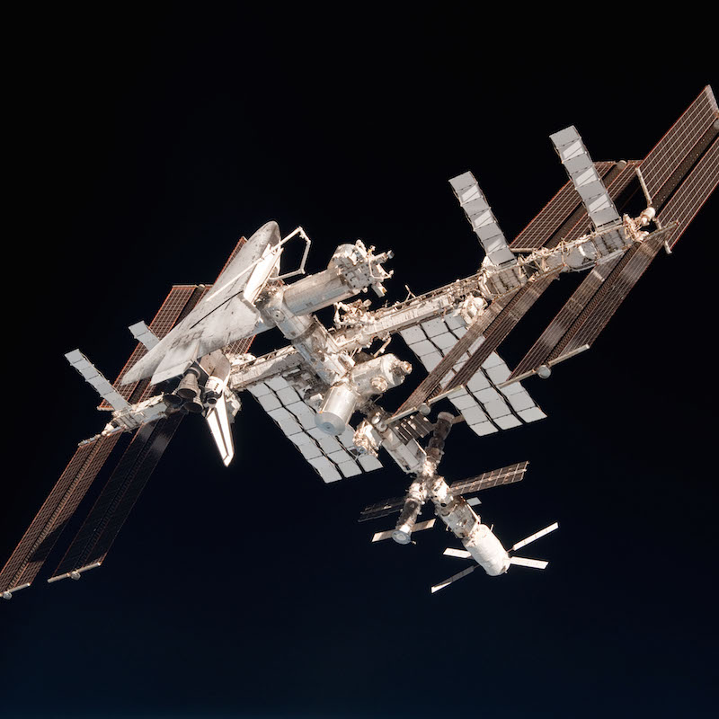

# Introduction

In December 2015, British ESA Astronaut Tim Peake is heading to the International Space Station for Mission Principia – and two Raspberry Pi computers with a special add-on board will be waiting for him. As part of his mission, he’ll be running experiments which utilise the board’s sensors, created and coded by school students.

# About the project

Two augmented Raspberry Pi computers (called Astro Pis) are being flown to the International Space Station (ISS) as part of British ESA Astronaut Tim Peake’s mission. They are both equipped with the mighty Sense HAT that can measure the environment inside the station, detect how it’s moving through space, and pick up the Earth’s magnetic field. Each Astro Pi is also equipped with a different kind of camera; one has an infra-red camera and the other has a standard visible spectrum camera.

This was the premise of the Astro Pi competition which closed in July. School-age students all over the UK were invited to devise computer science experiments for Tim to run on board the ISS. These experiments were in the form of Python programs written and tested by the students, using their own Sense HATs and Raspberry Pis.

Seven winning programs, now part of the Astro Pi payload, blasted off from Cape Canaveral Air Force Base in Florida on December 6th. They range from fun reaction time games to real science experiments looking at radiation in space.

# How I can participate

Even though the competition is closed, there are all sorts of ways you can get involved with Astro Pi!

They have a range of new Astro Pi educational resources available. Tim Peake will be on board the ISS until May 2016, there will be opportunities to examine the results of the winning competition experiments, and there will also be a data analysis activity where you can obtain a CSV file full of time-stamped sensor readings directly from Tim.

**[Get Involved](https://astro-pi.org/get-involved/)**

# Additional links

[Events](https://astro-pi.org/get-involved/events/)

[Program the Sense Hat](https://astro-pi.org/get-involved/program-the-sense-hat/)

[Buy the hardware](https://astro-pi.org/get-involved/buy-the-hardware/)

[Learning resources](https://astro-pi.org/resources/)

## Credits

[AstroPi website](https://astro-pi.org/)
