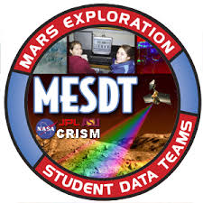

# Introduction

The NASA Jet Propulsion Laboratory (JPL) and Arizona State University (ASU) have partnered to create the Mars Space Flight Facility on the Arizona State University campus. The Mars Education Program located at the prestigious Mars Space Flight Facility at ASU has been developed under the dynamic partnership between JPL and ASU to explore the ever surprising and exciting red planet.

# About the project

Through the Mars Exploration Student Data Teams (MESDT), students (high school through college) join with Mars scientists to analyze real data from Mars. NASA and Arizona State University’s Mars Education Program is offering students nationwide the opportunity to be involved in authentic Mars research by participating in the Mars Exploration Student Data Teams (MESDT).

Teams of students in high school through college will have the opportunity to work with scientists, mission planners and educators on the collection and analysis of data as it is downloaded from instruments currently orbiting mars.

# How I can help

**US citizen only**

Students involved in MESDT will be working during the mission operations associated with the Mars Reconnaissance Orbiter. As far as the instrument we would be working with, it is CRISM (Compact Reconnaissance Imaging Spectrometer for Mars) on board the Mars Reconnaissance Orbiter, currently orbiting Mars. Some of the tasks student groups would be responsible for:
Work during mission operations, analyzing real Mars mission data.
Be responsible for specific exploration topics (i.e. polar caps, high latitudes, volcanic regions, MSL landing site locations, Phoenix lander location, etc.)
Retrieve current information from datasets (THEMIS, MRO, MER, etc.).
Watch for predicted flyovers of MSL and Phoenix lander sites, or similar lander sites (geomorphology), by Mars Odyssey, or MRO.

**[How to Start](http://marsed.mars.asu.edu/mesdt-how-to-start)**

# Additional links

[Mars Space Flight Facility staff](http://marsed.mars.asu.edu/staff)

[Mars Exploration Program](http://mars.jpl.nasa.gov/)

## Credits

[NASA](http://mars.jpl.nasa.gov)

[Mars Space Flight Facility, Arizona State University](http://marsed.mars.asu.edu/)
