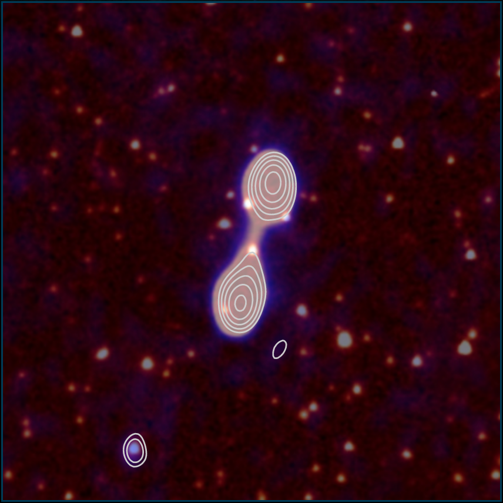

# Introduction

A black hole is a geometrically defined region of spacetime exhibiting such strong gravitational effects that nothing—including particles and electromagnetic radiation such as light—can escape from inside of it.
The theory of general relativity predicts that a sufficiently compact mass can deform spacetime to form a black hole.
The boundary of the region from which no escape is possible is called the event horizon.
Although crossing the event horizon has enormous effect on the fate of an object crossing it, it appears to have no locally detectable features.
In many ways a black hole acts like an ideal black body, as it reflects no light.
Moreover, quantum field theory in curved spacetime predicts that event horizons emit Hawking radiation, with the same spectrum as a black body of a temperature inversely proportional to its mass.
This temperature is on the order of billionths of a kelvin for black holes of stellar mass, making it essentially impossible to observe.

# About the project

Black holes are found at the center of most, if not all, galaxies. The bigger the galaxy, the bigger the black hole and the more sensational the effect it can have on the host galaxy. These supermassive black holes drag in nearby material, growing to billions of times the mass of our sun and occasionally producing spectacular jets of material traveling nearly as fast as the speed of light. These jets often can't be detected in visible light, but are seen using radio telescopes.

Astronomers have a good understanding of how small black holes (those that are several to tens of times more massive than our Sun) are formed. The picture is less clear for the supermassive black holes found in the center of galaxies. In order to better understand how these black holes form and evolve over time, astronomers need to observe many of them at different stages of their lifecycles. To do this, they need to find them first!

# How I can help

Astronomers need your help to find spectacular jets and match them to the galaxy that hosts them.
[Radio Galaxy Zoo](http://radio.galaxyzoo.org) gives you a visual tool where you can see two images of the same part of the sky, one from a radio telescope and one from an infrared telescope.
There is a requirement of the observation power and accuracy.

# Additional links

[Start classify](http://radio.galaxyzoo.org/#/classify)

[What is a Black Hole?](http://www.nasa.gov/audience/forstudents/k-4/stories/nasa-knows/what-is-a-black-hole-k4.html)

#Metadata
