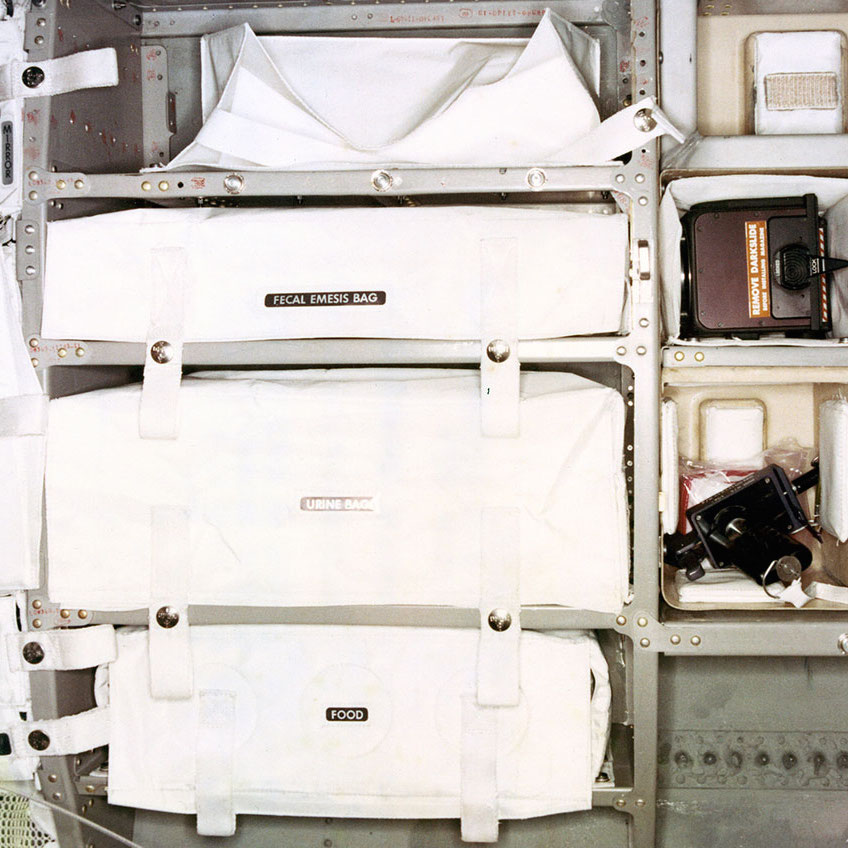

# Introduction

The National Museum of Air and Space (NASM) holds the premier collection of artifacts of the American Apollo Moon landing program. In addition to all of the recovered Apollo spacecraft, NASM been able to selectively collect provisions and equipment provided for the use of astronauts during their missions when those items were returned and were subsequently declared surplus to NASA’s mission requirements.

In fact, only a small fraction of such items were returned, with many remaining in unrecovered spacecraft - that is, in the Lunar Modules and Service Modules designed to be jettisoned before reentry into the Earth’s atmosphere. And of the items that were returned, not all were declared surplus and offered to the Smithsonian for the national collection. Other items were left on the surface of the Moon itself.

# About the project

The Smithsonian Transcription Center opened in July 2013 with thousands of documents across 31 projects from eight Smithsonian museums, archives, and libraries.

Helping to understand and contextualize the items in the Smithsonian collection is the heart of this transcription project, which will produce, from official NASA documents (stowage lists) a database of all government provided and contractor provided equipment originally placed on the spacecraft including information about scheduled transfers of each item from one location to another in the course of the missions.

At the time of each Apollo mission launch, NASA prepared a set of printed “as flown” stowage lists to document what items were to be stored on the spacecraft (both the Command Module and Lunar Module), which items were to be transferred from one to another before landing and after rendezvous in lunar orbit following the successful landing. These lists have, to our knowledge, never been assembled into a comprehensive, searchable database, and hence have not been as useful a tool as they might otherwise become. It is our intention, with this project, to create a reliable, searchable database of formal plans for these stowed items.

The results of this project will be a foundation for documenting the provenance and history of such flown items, for future research related to those items and to others that may be offered to the Smithsonian (even those that may at some future date be recovered from the Moon itself), and for augmenting our current and future exhibitions and displays.

# How can I help

The team of the center seeks to balance quality and speed with the transcription process - which of course is still evolving as they continue to develop this service. At the moment, this is how the system works:

1. Anyone can start transcribing or add to a transcription of a document.
2. Once a volunteer decides they've finished and they're ready for review, a different volunteer (who must have an account on the site) can review the transcription and either send it back for edits, or complete the transcription.
3. The finished transcript is sent to the Smithsonian, where it may be used immediately, or undergo additional work.

[Read the instruction](https://transcription.si.edu/instructions-apollo-stowage)

# Additional links

[The National Air and Space Museum Blog](http://blog.nasm.si.edu/space/transcribing-apollo-stowage-lists/)

[About the Smithsonian Transcription Center](https://transcription.si.edu/about)

## Credits

[NASA](http://nasa.gov)

[The Smithsonian Transcription Center](https://transcription.si.edu)
