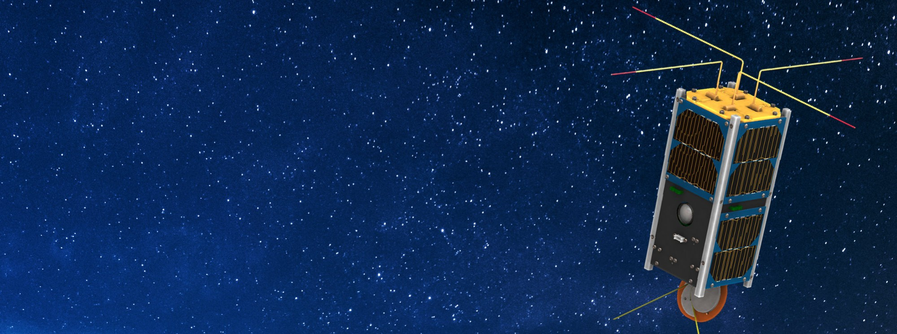

## About the project

University of Patras (MEAD & ECE departments) initiated the design and development of the first micro-satellite made in Greece: UPsat. The project was completed with the contribution, development and integration by the Greek based non-profit "Libre Space Foundation". With the contribution of scientists, engineers and programmers, UPSat was developed to participate in the QB50 international thermosphere research mission. UPSat is also the first satellite that its mechanical designs, software, and the vast majority of its components are freely available under open hardware and open software licenses.

UPSat is a nano-satellite with dimensions of 20cm x 10cm x 10cm,
in compliance with the cubesat size 2U classification.
Due to their small size, cubesats are often deployed into orbit
by special equipment on board of the International Space Station,
or as a secondary payload to other orbital missions of larger satellites.

The aim of the QB50 mission in which UPSat participates, is to create a network of fifty cubesat satellites made by Universities all over the world to study the lower layers of the thermosphere, which are the least explored parts of the atmosphere of our planet. Combined with other missions and laboratory data, the QB50 collected data will significantly improve the models that describe the atmosphere of our planet. The mission is designed and coordinated by the von Karman Institute of Fluid Dynamics.

As part of this mission UPsat is equipped with a specialized scientific instrument (mNLP) designed for its mission needs. Every other component of the satellite is designed from scratch, built, tested and integrated by engineers, scientists and developers of the University of Patras and Libre Space Foundation. That includes the structural framework, the on-board mission control computer, the telecommunications system, the power management system and the software that runs across all different subsystems.

The ground station segment will be part of the [SatNOGS Network](https://spacer.im/projects/satnogs),
to provide telemetry acquisition and command-and-control functionality.

## How I can participate

University of Patras and Libre Space Foundation, aspire to create an open source ecosystem around satellite and space technologies, with UPSat being the realization of that aspiration. Being an open source project, they welcome all possible contributions for further technological development of the project.

#### Software Development

Are you code-savy? How is your C? Visit one of their many repositories in GitHub and get involved!
They keep their issues updated for many contribution opportunities.

#### Telemetry Acquisition

Once UPSat is launched they would require your help for tracking telemetry
of the satellite and reporting it back. More info will follow soon.

## Useful links

[Website](https://upsat.gr)

[Contribute Page](https://upsat.gr/?page_id=13)

[Upsat People](https://upsat.gr/?page_id=15)

### Credits

[Upsat site](https://upsat.gr)
